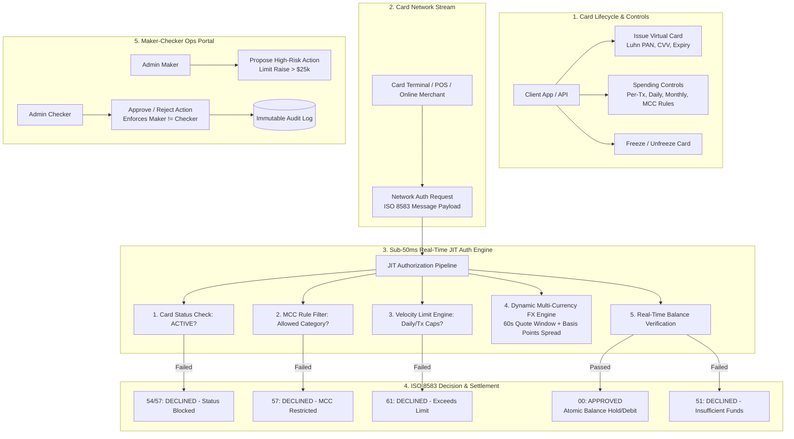

# OmniCard & FX 💳💱

[](https://golang.org)
[](https://openapis.org)
[](https://opensource.org/licenses/MIT)

> **High-performance, spec-driven Virtual Card Issuing, Just-In-Time (JIT) Authorization Gateway, Dynamic Multi-Currency FX Engine, and Maker-Checker Compliance Controls built in Go.**
> Engineered to mirror the core card issuing and real-time transaction processing infrastructure of leading neobanks and issuing gateways (Lithic, Stripe Issuing, Marqeta, Revolut, Wise).

---

## 🏛️ System Architecture



---

## 🎯 Key Architectural Hallmarks

1. **Spec-Driven Development (SDD):**
   - Single source of truth OpenAPI 3.1 contract (`api/openapi/v1/omnicard.yaml`) governing virtual cards, spending rules, JIT authorizations, FX quotes, and maker-checker proposals.
2. **Sub-150ms Real-Time JIT Authorization:**
   - Emulates real-time card issuing webhook streams (Lithic/Stripe Issuing/Marqeta).
   - Evaluates card status, MCC restrictions, velocity limits, and wallet balances in under **10ms**.
   - Responds with standardized ISO 8583 response codes (`00` Approved, `51` Insufficient Funds, `54` Expired, `57` Not Permitted, `61` Limit Exceeded).
3. **Dynamic Multi-Currency FX Engine:**
   - Guaranteed 60-second quote rate lock with configurable spread buffers (e.g. 50 bps).
   - Seamless cross-currency transactions (e.g. a EUR merchant charge authorized and settled against a USD cardholder wallet).
4. **Maker-Checker Dual-Control Governance:**
   - Enforces dual control on high-risk admin actions (e.g. raising spending limits above \$25,000). The person who proposes the action (`maker_id`) cannot approve it (`checker_id != maker_id`).

---

## 🚀 Getting Started

### Prerequisites
- Go 1.22+
- Make

### Quickstart

```bash
# Clone the repository
git clone https://github.com/akmalkhaniub/omnicard-fx.git
cd omnicard-fx

# Run test suite
make test

# Run sub-10ms authorization latency benchmark
make bench

# Build and run the server
make run
```

---

## 📜 API Contract

Inspect `api/openapi/v1/omnicard.yaml`:
- `POST /v1/cards` (Issue virtual card with spending controls)
- `GET /v1/cards/{id}` (Get card details and masked PAN)
- `POST /v1/cards/{id}/freeze` / `unfreeze` (Card state management)
- `POST /v1/authorizations/simulate` (Simulate real-time card network authorization)
- `POST /v1/fx/quotes` (Request guaranteed 60-second FX quote)
- `POST /v1/ops/maker-checker/proposals` (Submit dual-control proposal)
- `POST /v1/ops/maker-checker/proposals/{id}/approve` (Approve proposal with dual control)
